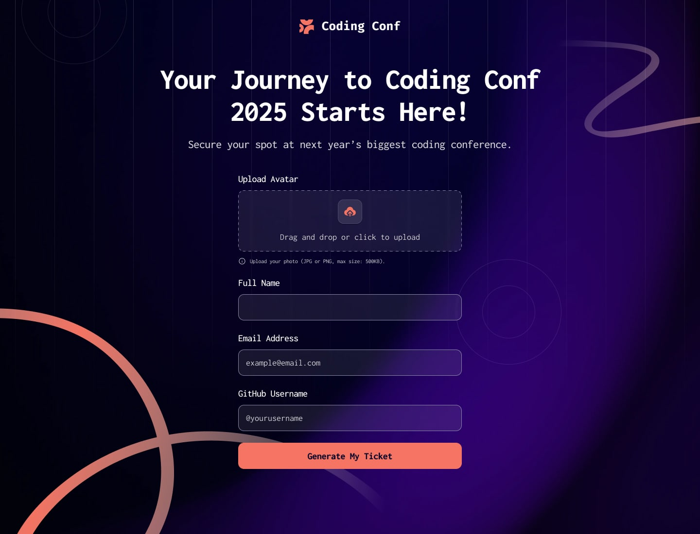

# Frontend Mentor - Conference ticket generator

## Welcome! 👋

### 🌐 **Links**
- 🔗 [GitHub](https://github.com/sukanyagurav/Conference-ticket-generator)
- 🚀 [Live URL](https://conference-ticket-generator5867.netlify.app/)

## Overview

In this challenge I build a conference ticket generator and make it look as close to the design as possible.

Goals:

- Fill out the form with their details.
- Receive validation messages if:
    - Any field is left empty.
    - The email address is incorrectly formatted.
    - The uploaded avatar is too large or in an unsupported format.
    - Complete the form using only their keyboard.
    - Have inputs, form hints, and error messages announced on their screen reader.
- See the generated conference ticket upon successful form submission.
- Experience an optimal layout across different screen sizes.
- See hover and focus states for all interactive elements.

## Author
👩‍💻 Frontend Mentor - [@sukanyagurav](https://www.frontendmentor.io/profile/sukanyagurav) 

**Have fun building!** 🚀
